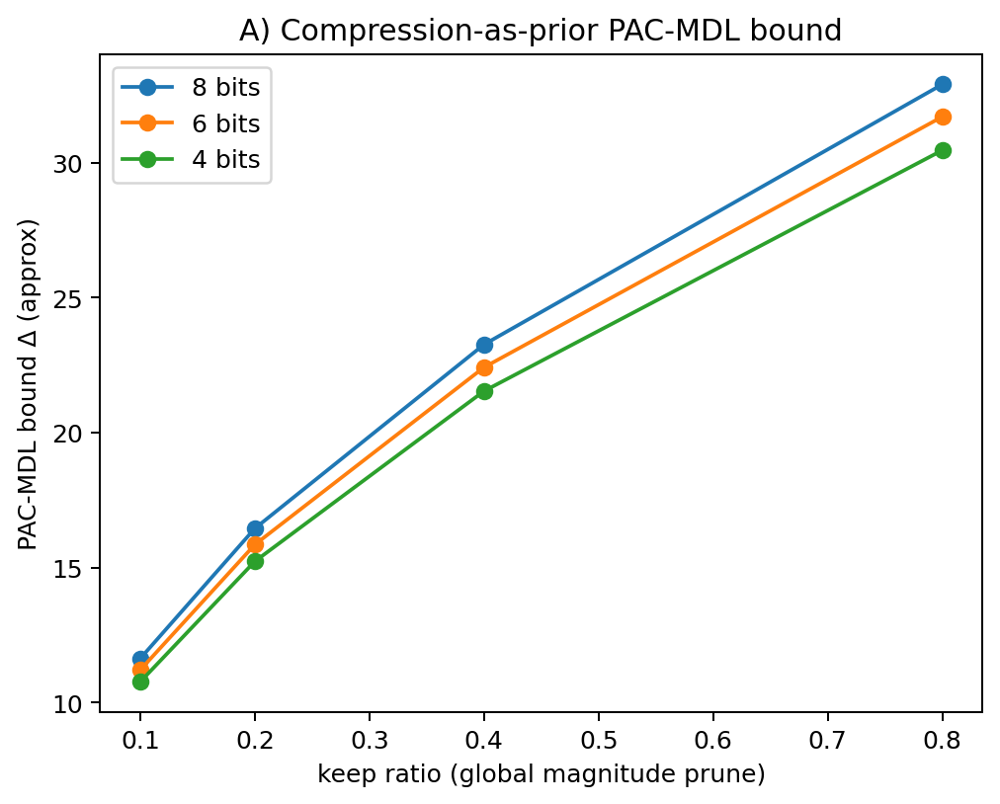
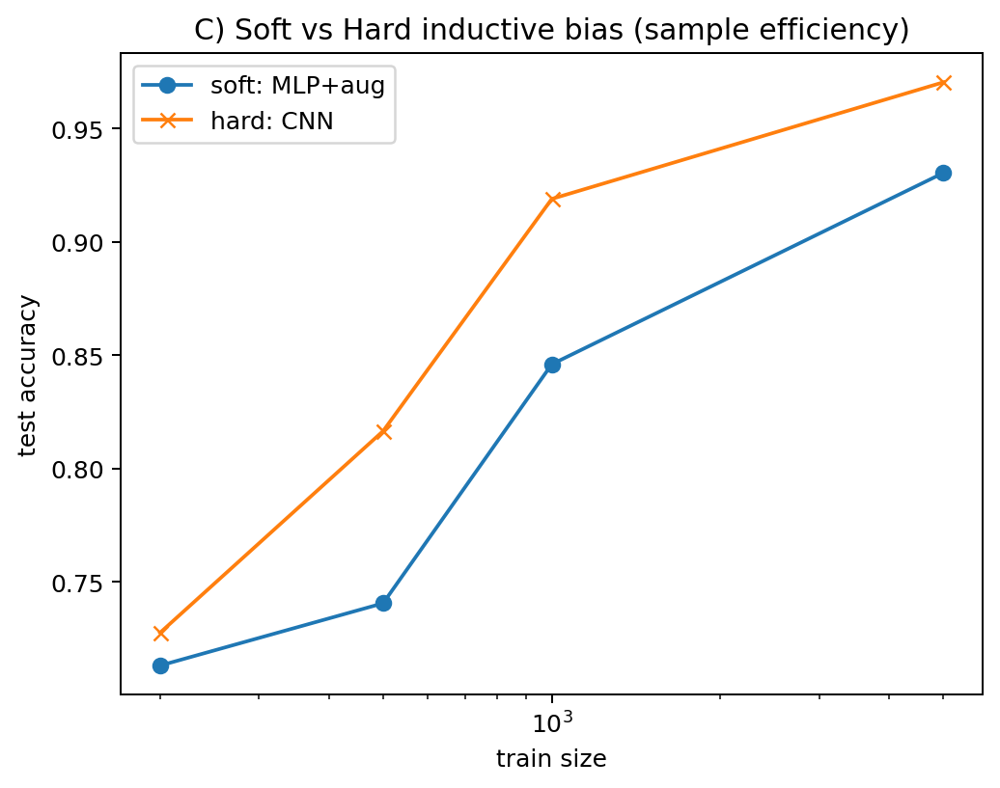
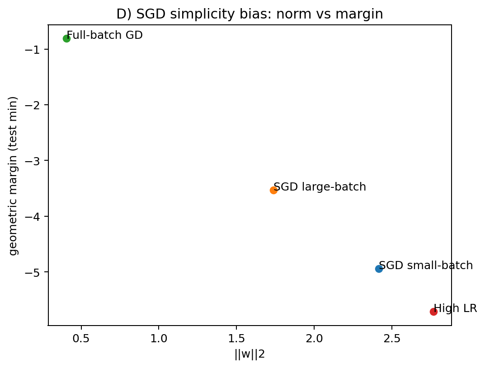
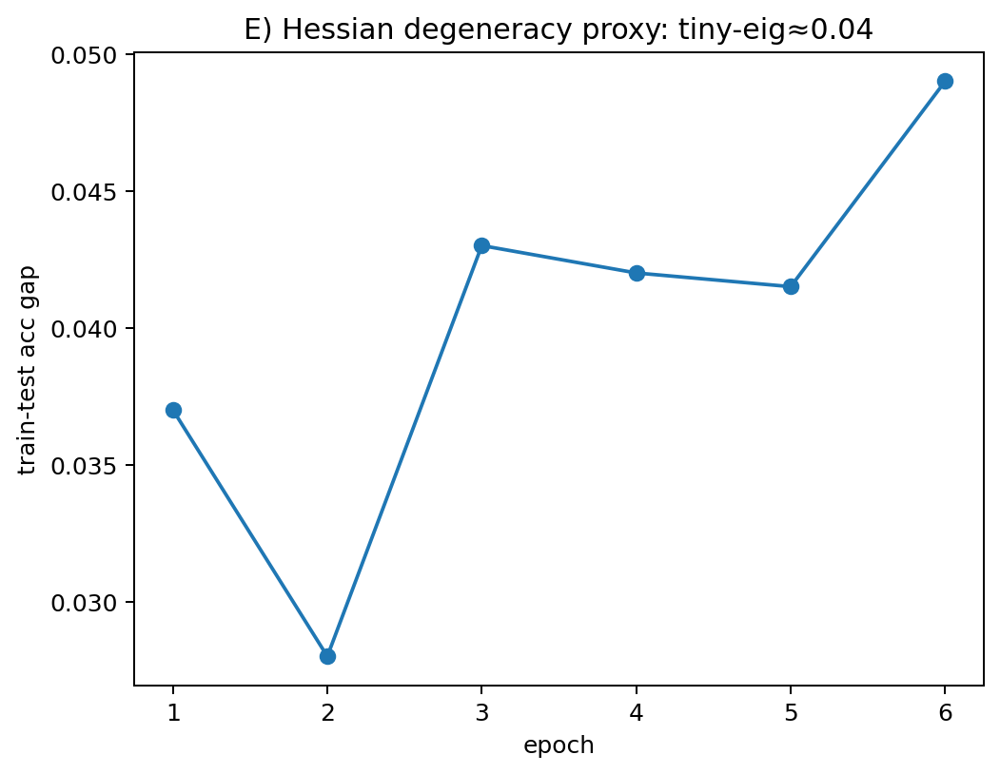

# Numerical experimation of "Deep Learning is Not So Mysterious or Different"

https://arxiv.org/abs/2503.02113

# contents 
* Benign overfitting of linear model(Ridge regression)
+ double descent curve in kernel regression
+ generization of GBDT(or ramdom forest)
+ deviation of PAC-bayes inequiality
+ representaiton learing as DNN specific feature

https://zenn.dev/xiangze/articles/c95b6105f985ae in Japanese

https://docs.google.com/presentation/d/1TLnCElJZAcqm3ZK8ANj3iHNT8-OXl1MHJysPhEto1MI/edit?usp=sharing

# code

> python3 allexperiments.py

## Benign overfitting of linear model(Ridge regression)

## deviation of PAC-bayes inequiality

##

# Critics

総じて既存の研究事実の追認である

- DNN以外のDDの存在、挙動は既に論文化されているものである。
- パラメータを増大させた場合の挙動に関するステートメントは検証されていないし、特異学習理論で想定される挙動と同一かどうか、それを含むのかどうかも主張できていない。
- PAC-Bayes boundの計算では明示的に事前分布を使っていてコルモゴロフ複雑性を使った形式にはなっていない
- コルモゴロフ複雑性の実例である圧縮アルゴリズムは例示されていない。
- 表現学習ではそもそもDNNは最終層を取り替えることができるで高性能になるというのは当たり前のようで主張が弱い

## Altanative ideas
- Benign overfittingの再現　「構造化されたデータに対しては帰納的バイアスが低いモデルでも汎化する」
- Solomonoff priorを使ったモデルのPAC-Bayes boundの実証(link)
- 次数に応じた正則化項(事前分布)の類似したより自然な概念の提唱
- [Surprises in High-Dimensional Ridgeless Least Squares Interpolation]()における　γ=n/p(データ数/パラメータ数)一定、あるいは変化させた場合のDNNでの対応事例
- 学習データを増やすと性能が悪化する（[Effective Model Complexity](https://arxiv.org/abs/1912.02292)）現象の再現
- SLT(Singular Learning Theory)における描像との対応付け
- 表現学習でのDNN１層分の表現能力の高さ(微分不可能関数などが近似できる)ことを主張する(既存研究あり)
### exprimantation plans
- A: 「汎化はパラメータ数でなく“符号長（=KL）”で制御」を圧縮→MDL事前で可視化
- B: データ側のアルゴリズム的複雑さを段階的に上げると汎化性能が悪化（同じアーキ/optimizerでも）
- C: ソフト拡張(データの持つ構造) vs ハード共有(畳み込み)でサンプル効率差を比較
- D: SGDの単純性バイアス：バッチ/学習率でマージンとノルムがどう動くかを観測
- E: ヘッシアン退化（近零固有値比と汎化ギャップの関係）を小規模で観測
- F: Deep Double Descent: width sweep × label-noise : 

# 結果
## 小規模な場合
- A: 「汎化はパラメータ数でなく“符号長（=KL）”で制御」を圧縮→MDL事前で可視化
    
- B: データ側のアルゴリズム的複雑さを段階的に上げると汎化性能が悪化（同じアーキ/optimizerでも）
    
- C: ソフト拡張(データの持つ構造) vs ハード共有(畳み込み)でサンプル効率差を比較
    
    ソフト拡張(データの持つ構造)は

- D: SGDの単純性バイアス：バッチ/学習率でマージンとノルムがどう動くかを観測
    

- E: ヘッシアン退化（近零固有値比と汎化ギャップの関係）を小規模で観測
    
    echocs1~6と少ない場合 汎化ギャップは大きくなってしまう。

- F: Deep Double Descent: width sweep × label-noise 